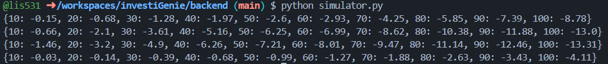
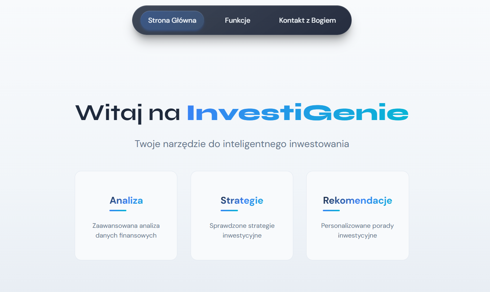
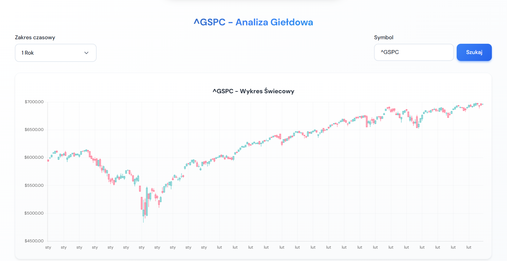
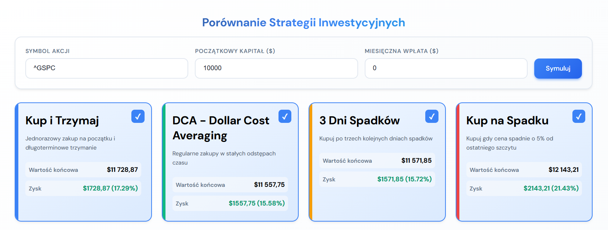
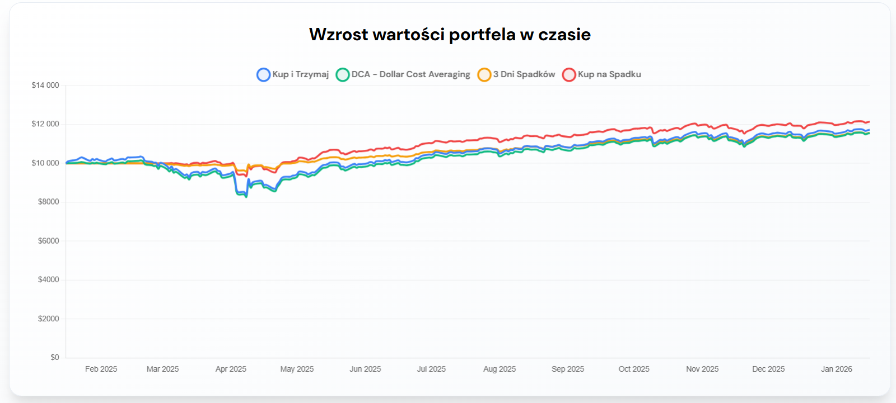
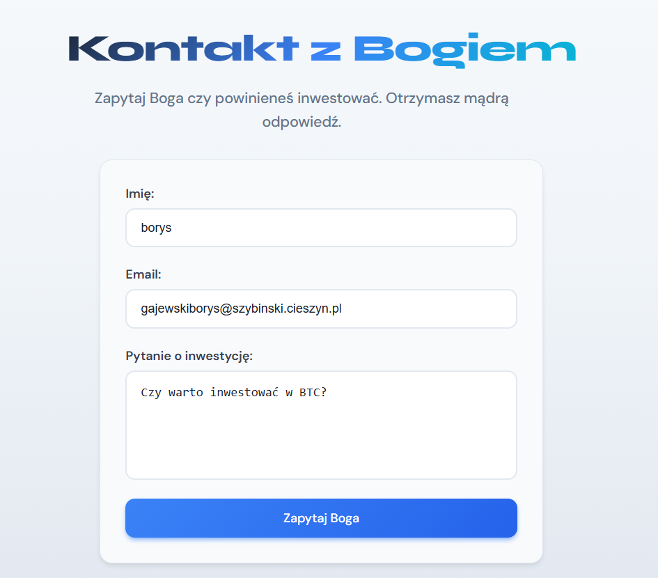

# Dokumentacja techniczna InvestiGenie

## Spis treści
- [Dokumentacja techniczna InvestiGenie](#dokumentacja-techniczna-investigenie)
  - [Spis treści](#spis-treści)
  - [Wstęp](#wstęp)
  - [Instalacja i uruchomienie](#instalacja-i-uruchomienie)
  - [Algorytmy i logika domenowa](#algorytmy-i-logika-domenowa)
    - [Pobieranie i parsowanie danych](#pobieranie-i-parsowanie-danych)
    - [Strategie i symulacje (backend)](#strategie-i-symulacje-backend)
    - [Strategie (frontend, symulacja klienta)](#strategie-frontend-symulacja-klienta)
  - [Rozmieszczenie i działanie komponentów](#rozmieszczenie-i-działanie-komponentów)
    - [Backend (FastAPI)](#backend-fastapi)
    - [Frontend (Next.js)](#frontend-nextjs)
    - [Komponenty funkcjonalne i przyciski](#komponenty-funkcjonalne-i-przyciski)
  - [Narzędzia pomocnicze (frontend)](#narzędzia-pomocnicze-frontend)
  - [Dane wejściowe/wyjściowe i formaty](#dane-wejściowewyjściowe-i-formaty)
  - [Znane ograniczenia](#znane-ograniczenia)

## Wstęp
InvestiGenie to aplikacja do podglądu notowań giełdowych i szybkiego testowania prostych strategii inwestycyjnych. Backend (FastAPI) pobiera dane z Yahoo Finance przez bibliotekę `yfinance` i zapisuje do CSV. Frontend (Next.js 15, React) prezentuje wykres świecowy, symuluje strategie na danych dziennych oraz udostępnia formularze i nawigację. Ścieżka danych: użytkownik wybiera zakres i symbol → Next.js proxy `/api/stock-data` → FastAPI `/api/stock-data` → `yfinance` → CSV → JSON → komponenty `StockChart` i `StrategyComparison`.

## Instalacja i uruchomienie
- Wymagania: Python 3.10+, Node.js 18+, internet dla pobierania danych z Yahoo Finance.
- Backend:
  - `cd backend`
  - `pip install -r requirements.txt`
  - `python -m uvicorn api_server:app --host 0.0.0.0 --port 8000 --reload`
- Frontend:
  - `cd frontend`
  - `npm install`
  - Opcjonalnie ustaw adres backendu: `echo "PYTHON_API_URL=http://localhost:8000" > .env.local`
  - `npm run dev`
- Domyślne adresy: backend `http://localhost:8000`, frontend `http://localhost:3000`. Proxy Next.js korzysta z `PYTHON_API_URL`.

## Algorytmy i logika domenowa

### Pobieranie i parsowanie danych
- [backend/api_data.py](https://github.com/lis531/investiGenie/blob/main/backend/api_data.py): `get_api_data(function_index, symbol, interval_index)` wybiera interwał (intraday/dzienny/tygodniowy/miesięczny), pobiera dane przez `yfinance`, mapuje kolumny na `timestamp,open,high,low,close,volume`, formatuje daty (pełna data-godzina dla intraday), zapisuje do `stock_data.csv`.
- [backend/csv_data.py](https://github.com/lis531/investiGenie/blob/main/backend/csv_data.py): `get_csv_data(path, period)` filtruje wiersze CSV po zakresie dat (formaty `%m/%d/%Y` lub `%Y-%d-%m`), zwraca listę wierszy.
- [backend/api_server.py](https://github.com/lis531/investiGenie/blob/main/backend/api_server.py): `get_stock_data(range, symbol)` określa funkcję pobierającą (intraday dla `1d`, dzienną dla `1w/1m/1y`), odpytuje `get_api_data`, czyta `stock_data.csv`, parsuje przez `parse_stock_data`, filtruje liczbę dni (7/22/252) lub pojedynczy dzień intraday, sortuje chronologicznie i zwraca JSON `{success, data[], range, symbol}`. Pomocnicze: `calculate_date_range`, `get_function_index_for_range`, `parse_stock_data` (oblicza dzienną zmianę w % i odrzuca wiersze z zerowymi cenami).
- [frontend/src/app/api/stock-data/route.ts](https://github.com/lis531/investiGenie/blob/main/frontend/src/app/api/stock-data/route.ts): Next.js proxy `GET /api/stock-data` przekazuje `range` i `symbol` do FastAPI (`PYTHON_API_URL`), zwraca JSON albo błąd 500.

### Strategie i symulacje (backend)
- [backend/algorithms.py](https://github.com/lis531/investiGenie/blob/main/backend/algorithms.py):
  - `buy_after_3_consecutive_down_days(i, prices)`: kup gdy trzy kolejne spadki poprzedzają bieżący dzień.
  - `buy_everyday(i, prices)`: kupuj codziennie.
  - `buy_and_hold(i, prices)`: pojedynczy zakup w dniu 0, potem hold.
  - `buy_the_dip(i, prices, dip_threshold=0.05, lookback_window=10)`: kup gdy cena < ostatni szczyt * (1 - próg).
  - `moving_average_crossover(current_day, prices, lookback_windows=(20,5))`: kup przy przecięciu krótkiej średniej powyżej długiej (sygnał zmiany trendu w górę).
  - `reversal_after_a_decline(current_day, prices, downtrend_length=5)`: kup gdy następuje odbicie po ciągu spadków `downtrend_length`.
- [backend/simulator.py](https://github.com/lis531/investiGenie/blob/main/backend/simulator.py):
  - `buy(cash, owned_quantity, price, order_quantity=1)` / `sell(...)`: operacje na gotówce i ilości akcji z walidacją środków.
  - `algorithm_wrapper(prices, start_cash, monthly_cash, algorithm, exposure_type="fixed_fraction", exposure_value=0.1)`: symuluje dzień po dniu, dopłaca środki co 21 dni, ustawia `stop_loss`/`take_profit` (niewykorzystane w algorytmach), kalkuluje wielkość zlecenia na podstawie ekspozycji.
  - `simulate(algorithm, start_cash=100000, monthly_cash=0, stock='stock_data.csv', exposure_type="fixed_fraction", exposure_value=0.1)`: iteruje po oknach danych, uruchamia `algorithm_wrapper`, liczy średni procent zysku dla różnych długości okna, zwraca słownik wyników i rysuje wykres.

Zdjęcie 1: Wykres wyników symulatora backend

### Strategie (frontend, symulacja klienta)
- [frontend/src/utils/strategyAlgorithms.ts](https://github.com/lis531/investiGenie/blob/main/frontend/src/utils/strategyAlgorithms.ts): `buy_after_3_down`, `buy_everyday`, `buy_and_hold`, `buy_the_dip` w wersji TypeScript, zwracają "buy" lub "none" na podstawie bieżącego indeksu i szeregu cen.
- [frontend/src/components/StrategyComparison.tsx](https://github.com/lis531/investiGenie/blob/main/frontend/src/components/StrategyComparison.tsx): pobiera dane przez `/api/stock-data?range=1y`, tnie ostatnie 252 dni, iteruje po strategiach z `strategyAlgorithms`, symuluje portfel (dokupienie co 21 dni, ekspozycja 10% kapitału, dla buy&hold 100%), zapisuje historię wartości portfela. Oblicza `final_value`, `total_invested`, `profit`, `profit_percentage`, `shares_owned`, `cash_remaining`, `portfolio_history` dla każdej strategii.

## Rozmieszczenie i działanie komponentów

### Backend (FastAPI)
- Endpoint: `GET /api/stock-data` w [backend/api_server.py](https://github.com/lis531/investiGenie/blob/main/backend/api_server.py). Parametry `range=1d|1w|1m|1y`, `symbol` (domyślnie `^GSPC`). Zwraca posortowaną listę punktów czasowych do wykresu świecowego.
- Pliki wspierające: [backend/api_data.py](https://github.com/lis531/investiGenie/blob/main/backend/api_data.py) (pobranie danych), [backend/csv_data.py](https://github.com/lis531/investiGenie/blob/main/backend/csv_data.py) (filtrowanie CSV), [backend/algorithms.py](https://github.com/lis531/investiGenie/blob/main/backend/algorithms.py) i [backend/simulator.py](https://github.com/lis531/investiGenie/blob/main/backend/simulator.py) (testy strategii w Pythonie), [backend/plots.py](https://github.com/lis531/investiGenie/blob/main/backend/plots.py) (wizualizacje lokalne Matplotlib).

### Frontend (Next.js)
- Routing i layout: [frontend/src/app/page.tsx](https://github.com/lis531/investiGenie/blob/main/frontend/src/app/page.tsx) (ekran powitalny), [frontend/src/app/features/page.tsx](https://github.com/lis531/investiGenie/blob/main/frontend/src/app/features/page.tsx) (główne funkcje), [frontend/src/app/contact_god/page.tsx](https://github.com/lis531/investiGenie/blob/main/frontend/src/app/contact_god/page.tsx) (formularz „Kontakt z Bogiem”).
- API proxy: [frontend/src/app/api/stock-data/route.ts](https://github.com/lis531/investiGenie/blob/main/frontend/src/app/api/stock-data/route.ts) kieruje żądania do FastAPI. [frontend/src/app/api/strategies/route.ts](https://github.com/lis531/investiGenie/blob/main/frontend/src/app/api/strategies/route.ts) wskazuje na nieistniejący endpoint `/api/strategies` w backendzie (symulacje są obecnie liczone w przeglądarce).
- Nawigacja: komponent [frontend/src/components/navigation.tsx](https://github.com/lis531/investiGenie/blob/main/frontend/src/components/navigation.tsx) rysuje pasek menu z podświetleniem aktywnej trasy. Linki: „Strona Główna”, „Funkcje”, „Kontakt z Bogiem”.
- Stopka: [frontend/src/components/footer.tsx](https://github.com/lis531/investiGenie/blob/main/frontend/src/components/footer.tsx) wyświetla rok i nazwę produktu.

### Komponenty funkcjonalne i przyciski
- **Home** ([frontend/src/app/page.tsx](https://github.com/lis531/investiGenie/blob/main/frontend/src/app/page.tsx)): statyczny hero z kartami „Analiza”, „Strategie”, „Rekomendacje”.

Zdjęcie 2: Ekran główny aplikacji InvestiGenie

- **StockChart** ([frontend/src/components/StockChart.tsx](https://github.com/lis531/investiGenie/blob/main/frontend/src/components/StockChart.tsx))
  - Dane: pobiera przez `/api/stock-data` na podstawie `range` i `symbol`.
  - Kontrolki: rozwijane menu „Zakres czasowy” (1d/1w/1m/1y), pole tekstowe „Symbol”, przycisk „Szukaj” wysyłający żądanie z bieżącym zakresem. Kliknięcie opcji zakresu refetchuje dane i zamyka dropdown. Stan ładowania pokazuje spinner i overlay. Statystyki pod wykresem: aktualna cena, dzienna zmiana, wolumen z pierwszego elementu danych.
  - Wizualizacja: wykres świecowy Chart.js Financial; oś X pokazuje czas (godzina dla 1d, dzień/miesiąc dla reszty), tooltip prezentuje OHLC i zmianę procentową.

Zdjęcie 3: Wykres świecowy StockChart z danymi rynku

- **StrategyComparison** ([frontend/src/components/StrategyComparison.tsx](https://github.com/lis531/investiGenie/blob/main/frontend/src/components/StrategyComparison.tsx))
  - Dane: używa danych z `/api/stock-data?range=1y` do symulacji klienta.
  - Kontrolki: pola wejściowe „Symbol akcji”, „Początkowy kapitał”, „Miesięczna wpłata”; przycisk „Symuluj” uruchamia ponowną symulację na aktualnych parametrach. Klikalne kafelki strategii pozwalają włączać/wyłączać krzywe na wykresie. Kafelki pokazują nazwę, opis, wartość końcową i zysk.
  - Wizualizacja: wykres liniowy wartości portfela w czasie z wieloma seriami, legenda i tooltip z wartością portfela i zyskiem dla każdej strategii.

Zdjęcie 4: Porównanie strategii - wykres linii portfela

Zdjęcie 5: Porównanie strategii - kafelki wyników

- **Contact God** ([frontend/src/app/contact_god/page.tsx](https://github.com/lis531/investiGenie/blob/main/frontend/src/app/contact_god/page.tsx))
  - Kontrolki: pola „Imię”, „Email”, „Pytanie o inwestycję”; przycisk „Zapytaj Boga”.
  - Działanie: deterministycznie oblicza hash z treści pytania, losuje odpowiedź TAK/NIE i komunikat z predefiniowanej listy; wynik wyświetla w karcie pod formularzem.

Zdjęcie 6: Formularz Kontakt z Bogiem z polami wejściowymi

Zdjęcie 7: Odpowiedź generatora Kontakt z Bogiem

- Wspólny CSS i layout: `globals.css`, `page.module.css` w poszczególnych widokach, style modułowe przy komponentach.

## Narzędzia pomocnicze (frontend)
- [frontend/src/utils/csvParser.ts](https://github.com/lis531/investiGenie/blob/main/frontend/src/utils/csvParser.ts): parser CSV i formatowanie dat do `YYYY-MM-DD` dla ewentualnego odczytu plików z katalogu backendu (obecnie nieużywany w głównych widokach).
- [frontend/src/utils/strategyAlgorithms.ts](https://github.com/lis531/investiGenie/blob/main/frontend/src/utils/strategyAlgorithms.ts): definicje strategii w TypeScript używane w `StrategyComparison`.

## Dane wejściowe/wyjściowe i formaty
- JSON z `/api/stock-data`: tablica obiektów `{date, price, open, high, low, volume, change, file_name}` posortowana rosnąco po czasie (po filtracji). Wartość `change` to procentowa zmiana między `open` a `close` dla wiersza.
- Wymagane parametry użytkownika na frontendzie: symbol giełdowy zgodny z Yahoo Finance, zakres czasowy (1d/1w/1m/1y), kapitał startowy i miesięczny dla symulacji.

## Znane ograniczenia
- Endpoint `/api/strategies` w backendzie jest nieaktywny; symulacje wykonuje frontend. Plik [frontend/src/app/api/strategies/route.ts](https://github.com/lis531/investiGenie/blob/main/frontend/src/app/api/strategies/route.ts) zwróci błąd, jeśli backend nie udostępnia tej ścieżki.
- Symulator po stronie backendu ([backend/simulator.py](https://github.com/lis531/investiGenie/blob/main/backend/simulator.py)) jest uruchamiany ad-hoc, brak ekspozycji HTTP. `stop_loss` i `take_profit` są ustawiane, ale żaden algorytm nie generuje tych sygnałów.